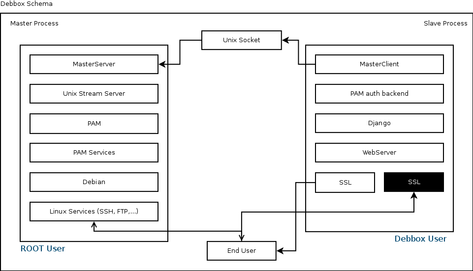

Master/Slave Processes
**********************
Debbox use a Master/Slave process schema to provide a safe and easy to use communication layer between normal users environment and root user environment.
Since wide range of administration jobs only allowed under root user, Debbox needs to run some of its code under root user, but running a web server and 
application under root user is bad security risk. So the best choice is to have two different process, one of them will handle the administration issues that
should runs under root user and another one will communicate with user as the Web application user interface.

Master Process
==============
The process that run under root user will be Master Process. The main objective of master process is to run the Slave process request under the root user privilege and 
return the request result as a response to Slave Process. but beside this objective master process have some other tasks like forking the Slave process.

Master Process will be runs with **server.py** script on the Starting time of Debbox, then it will fork a process from itself and change the ownership of the child process
to ``debbox`` user (the default user of Debbox is ``debbox`` but user may change that from Debbox configuration file in ``/etc/debbox/debbox.conf``), so new process will
continue its work under non-root user, Master Process will run the :py:mod:`MasterServer` and wait for Slave process requests. 

Master process will create two pid file in the ``piddir`` with name of ``debbox_master.pid`` and ``debbox_slave.pid`` before running its main loop. Also it will remove those
files when the Debbox server stop actio called. Master process remove all the temporary files in ``/tmp/`` too.

Slave Process
=============
Slave process task is very simple, run a gevent web server and passing user requests too Debbox web application, and giving back the response to user. Since Slave process is running
under a non-root user, it should communicate to **Master Server** via :py:mod:`MasterClient`.

Slave process that is the child of Master process will run a GEvent pywsgi webserver with a two way SSL socket so all the request to web server should use a SSL socket, all the non-SSL
request will dropped.

After receiving requests by Slave process and passing them to Debbox web application every thing else will be like a normal Django web application.

Schema
^^^^^^

In the above schema you can see a schema of how Debbox Master/Slave process works
