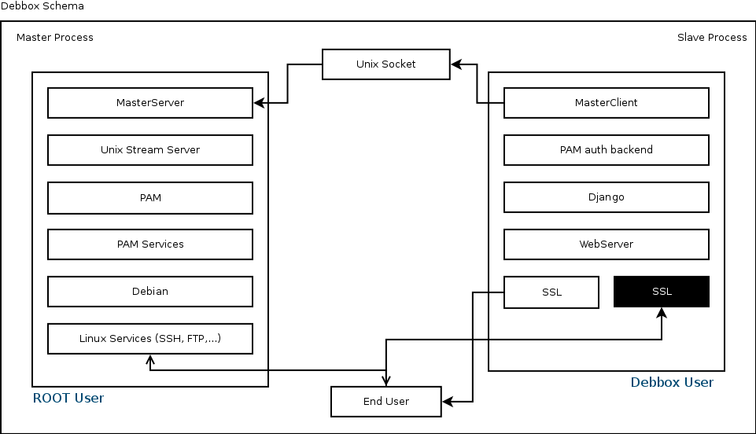

Debbox Web Server
*****************

.. py:currentmodule:: debbox.core.servers

Debbox use the :py:mod:Lotus webserver as its own embedded web server with enforce of SSL connection. Since
Debbox Web Server is one of the important components of Debbox and it is the main user interface of the whole
project web server security is in the high priority. Debbox provide a two way SSL connection to avoid any unwanted
data sniffing between the Debbox user and Debbox UI. Sysadmin can configure the Debbox SSL in the main configuration file

Debbox web server work in a event base manner and pass the user requests to Debbox web application wsgi script, so wsgi
script of web application is responsible for generating a response it give it back to web server. and the web server will
encrypt that with second SSL key and send that to user. take a look at the schema below.

web application WSGI run the Django web application and everything goes into Django web application. that's it. Here is the
description of WebServer class:

.. autoclass:: WebServer
   :members:

